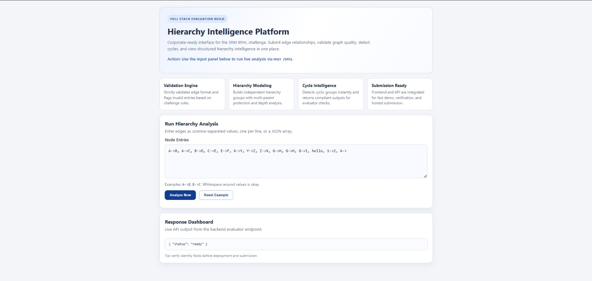
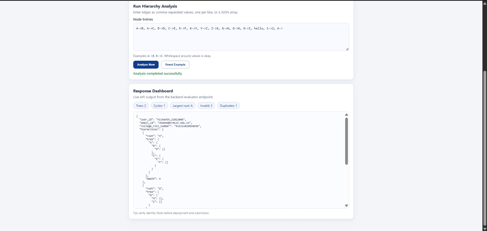
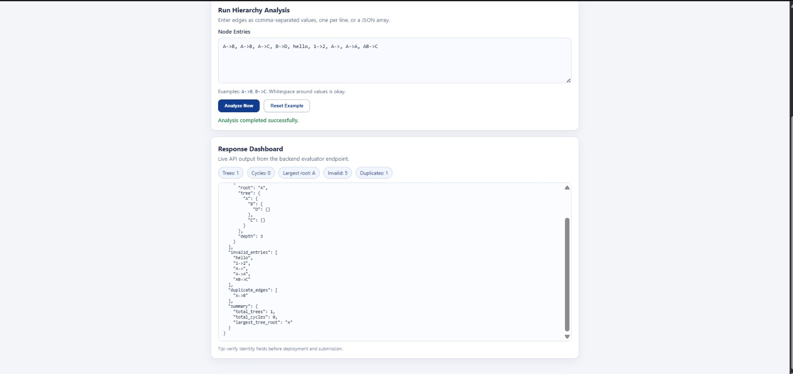
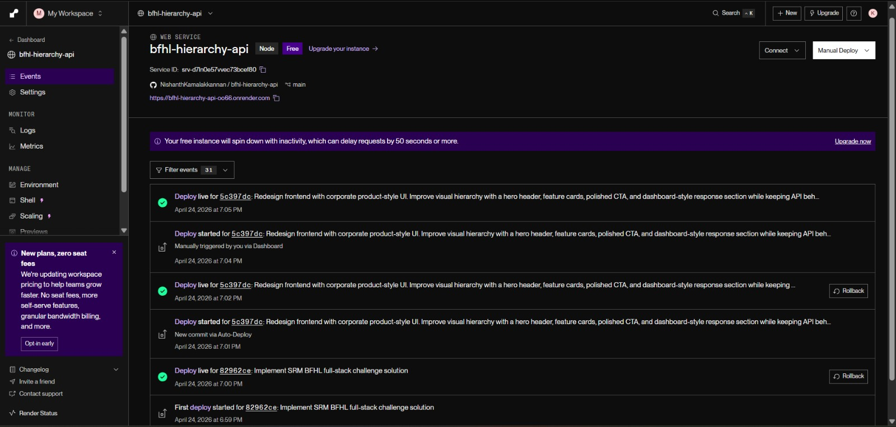

# BFHL Hierarchy API - Full Stack Challenge Submission

A production-style implementation of the SRM Full Stack Engineering Challenge (Bajaj Finserv Health), built with Node.js and Express.

This repository includes:
- A compliant backend endpoint: `POST /bfhl`
- A professional single-page frontend to test and visualize responses
- Automated tests for edge cases and challenge-specific logic

---

## Live Links

- **Frontend URL:** `https://bfhl-hierarchy-api-oo66.onrender.com`
- **Backend Base URL:** `https://bfhl-hierarchy-api-oo66.onrender.com`
- **GitHub Repository:** `https://github.com/NishanthKamalakkannan/bfhl-hierarchy-api`

> Backend evaluator route: `POST <base-url>/bfhl`

---

## Problem Statement Summary

The API accepts relationship entries like `A->B`, builds hierarchy groups, validates malformed input, handles duplicate and multi-parent rules, detects cycles, and returns structured insights in a strict response format.

---

## Tech Stack

- **Backend:** Node.js, Express
- **Frontend:** HTML, CSS, Vanilla JavaScript
- **Testing:** Node test runner (`node --test`)
- **Hosting:** Render

---

## Core Features Implemented

### API Compliance
- `POST /bfhl` with `Content-Type: application/json`
- CORS enabled for cross-origin evaluator calls
- JSON payload validation with safe error responses

### Graph Processing Rules
- Valid format check: `X->Y` (`X` and `Y` are single uppercase letters)
- Invalid entry capture in `invalid_entries`
- Self-loop handling (e.g., `A->A`) as invalid
- Duplicate edge tracking in `duplicate_edges` (stored once)
- Multi-parent handling: first parent wins, later parent edges ignored
- Independent connected-group hierarchy construction
- Cycle detection per group (`has_cycle: true`, `tree: {}`, no `depth`)
- Depth calculation for non-cyclic trees
- Summary generation with tie-break for `largest_tree_root`

---

## Project Structure

```text
.
|-- public/
|   `-- index.html          # Corporate-style frontend UI
|-- src/
|   |-- hierarchy.js        # Core hierarchy processing logic
|   `-- server.js           # Express API server
|-- test/
|   `-- hierarchy.test.js   # Rule-based test cases
|-- .env.example
|-- package.json
`-- README.md
```

---

## API Contract

### Endpoint

- **Method:** `POST`
- **Path:** `/bfhl`
- **Content-Type:** `application/json`

### Sample Request

```json
{
  "data": ["A->B", "A->C", "B->D"]
}
```

### Sample Response Shape

```json
{
  "user_id": "fullname_ddmmyyyy",
  "email_id": "your_college_email",
  "college_roll_number": "your_roll_number",
  "hierarchies": [
    {
      "root": "A",
      "tree": { "A": { "B": { "D": {} }, "C": {} } },
      "depth": 3
    }
  ],
  "invalid_entries": [],
  "duplicate_edges": [],
  "summary": {
    "total_trees": 1,
    "total_cycles": 0,
    "largest_tree_root": "A"
  }
}
```

---

## Local Setup

### 1) Clone and install

```bash
git clone https://github.com/NishanthKamalakkannan/bfhl-hierarchy-api.git
cd bfhl-hierarchy-api
npm install
```

### 2) Set environment variables

Use real values for submission identity fields:

- `USER_ID` (format: `fullname_ddmmyyyy`)
- `EMAIL_ID`
- `COLLEGE_ROLL_NUMBER`

PowerShell example:

```powershell
$env:USER_ID="nishanth_21022006"
$env:EMAIL_ID="nk8644@srmist.edu.in"
$env:COLLEGE_ROLL_NUMBER="RA2311026010696"
```

### 3) Start server

```bash
npm start
```

Development mode:

```bash
npm run dev
```

App runs on `http://localhost:3000`.

---

## Testing

Run all tests:

```bash
npm test
```

Current suite validates:
- invalid and duplicate entry handling
- multi-parent edge behavior
- cycle handling output format
- expected summary from challenge-style input

---

## Deployment (Render)

Use a single **Web Service**:
- Build command: `npm install`
- Start command: `npm start`
- Environment variables:
  - `USER_ID`
  - `EMAIL_ID`
  - `COLLEGE_ROLL_NUMBER`

After deployment, verify:
- Frontend: `<base-url>/`
- Health: `<base-url>/health`
- API: `POST <base-url>/bfhl`

---

## Screenshots

Place your images in `docs/images/` using the file names below:

1. `homepage.jpeg` - Landing UI / Hero section  
2. `analysis-success.jpeg` - Successful API response in dashboard  
3. `invalid-duplicate-case.jpeg` - Input with invalid + duplicate entries  
4. `render-deployment.jpeg` - Render service live/deploy screen

README image previews:






---

## Submission Checklist

- [x] Frontend URL is live
- [x] Backend responds to `POST /bfhl`
- [x] CORS enabled
- [x] Public GitHub repository
- [x] Challenge rules implemented without hardcoded responses

---

## Author

**Nishanth Kamalakkannan**  
SRM Institute of Science and Technology
